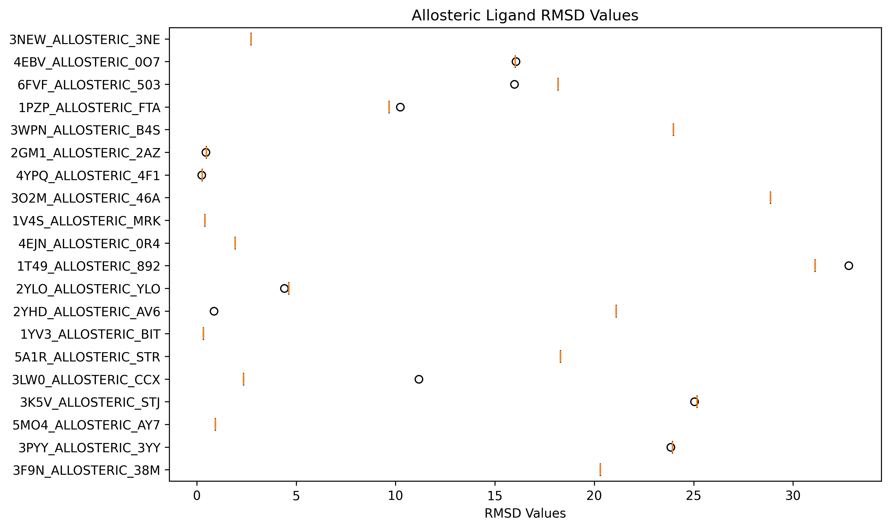
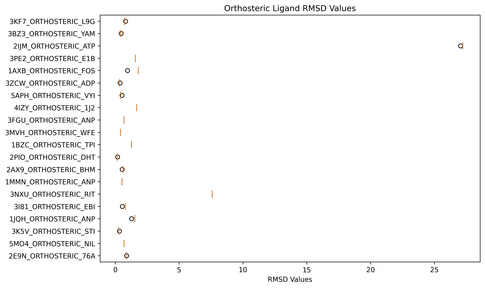

# M-Boltz Hackathon Submission — Challenge 2 (Allosteric/Orthosteric)

- **Team**: QURE
- **Authors**: Tony Enrique Astuhuaman Davila; Dr. Ridwan Sakidja
- **Affiliation**: Missouri State University
- **Email**: ta787s@missouristate.edu; RidwanSakidja@MissouriState.edu
- **Repository**: https://github.com/trobutlef/boltz-hackathon-template
- **Challenge**: Allosteric/Orthosteric ligand prediction (ASOS)
- **Primary metric**: Mean Top-1 ligand RMSD (lower is better)

## Method summary

We implement a training-free pipeline that improves structural accuracy via diversity in sampling and hybrid re-ranking, implemented only in the template hooks in `hackathon/predict_hackathon.py`.

- **Diversity (prepare step)**: `prepare_protein_ligand()` generates multiple light configs using different seeds and low `diffusion_samples` with small `recycling_steps` to encourage pose variety. We avoid unsupported YAML fields to ensure schema compatibility.
- **Hybrid re-ranking (post step)**: `post_process_protein_ligand()` ranks all produced PDBs using:
  - Boltz per-sample confidence from `confidence_*_model_k.json`.
  - Interface features computed directly from PDBs (no extra deps):
    - Contacts↑ (protein–ligand heavy atom pairs ≤ 4.5 Å)
    - Clashes↓ (protein–ligand heavy atom pairs < 2.2 Å)
    - H-bond proxy↑ (ligand N/O to protein heavy ≤ 3.5 Å)
    - Pocket depth↑ (ligand COM to nearest protein CA distance, inverted)
  - Features are min–max normalized per-datapoint and combined with fixed weights.

All modifications are confined to the two hook functions and helpers inside `hackathon/predict_hackathon.py`. The CLI and evaluation flow are unchanged.

## How to run (validation set)

Prereqs: `conda env create -f environment.yml --name boltz && conda activate boltz && pip install -e ".[cuda]"` and download/extract `hackathon_data.tar.gz` into `hackathon_data/`.

- **Predict + evaluate** (runs both):
```
python hackathon/predict_hackathon.py \
  --input-jsonl hackathon_data/datasets/asos_public/asos_public.jsonl \
  --msa-dir hackathon_data/datasets/asos_public/msa/ \
  --submission-dir ./my_predictions \
  --intermediate-dir ./tmp/ \
  --result-folder ./my_results
```
- Outputs:
  - Predictions: `my_predictions/{datapoint_id}/model_0..4.pdb`
  - Metrics: `my_results/combined_results.csv` and plots (orthosteric/allosteric RMSD)

- **Evaluate-only** (re-run metrics on existing predictions):
```
python hackathon/evaluate_asos.py \
  --dataset-file hackathon_data/datasets/asos_public/asos_public.jsonl \
  --submission-folder ./my_predictions \
  --result-folder ./my_results
```

## Runtime notes

- Reference hardware (README): full ASOS set finishes ~60 minutes with default settings.
- Our settings sample more poses; for a full run budget ~2–4 hours depending on GPU/CPU.
- To speed up: reduce seeds and/or `diffusion_samples` in `prepare_protein_ligand()`.

## Results (validation set)

**Summary metrics:**

- **Mean Top-1 RMSD (All)**: 7.51 Å
- **Mean Top-1 RMSD (Orthosteric)**: 2.48 Å
- **Mean Top-1 RMSD (Allosteric)**: 12.54 Å
- **Mean Top-5 Min RMSD (All)**: 6.89 Å
- **RMSD < 2 Å in Top-5**: 25/40 (62.5%)

See `my_results/combined_results.csv` for per-datapoint metrics. The summary is printed at the end of evaluation.
Figures saved by the evaluation script:





## Implementation details

- File: `hackathon/predict_hackathon.py`
  - `prepare_protein_ligand(...)` — creates multiple configs using seeds and light sampling (`--diffusion_samples 2`, `--recycling_steps 2`). We removed unsupported pocket YAML fields to avoid parse errors.
  - `post_process_protein_ligand(...)` — extracts features from PDBs and confidence JSONs and ranks with a weighted score. Returns top-5 `Path`s for submission.
- No other files modified. All temporary files are written under `--intermediate-dir`.

## Optional appendix — Docking/Vina and MTP motivation (non-scored)

We provide an optional offline analysis (not required for evaluation) to study the relationship between learned confidence and physics-based scoring.

- For a small subset (e.g., 10–15 datapoints):
  1. Prepare receptor from ground-truth by removing the ligand.
  2. Dock the provided ligand with AutoDock Vina/smina (local; not part of submission).
  3. Compare Vina scores vs. Boltz confidence and vs. our hybrid rank position for `model_0..4`.
  4. Report correlations/plots here.

- Rationale: Multipole-augmented scoring (MTP-like) may improve energy fidelity; we treat this as motivation for future work since the hackathon’s official metric is structural RMSD, not energy.

> Note: The Vina/MTP analysis is a proof-of-concept explored separately and was not executed as part of this official submission. It represents planned future work.

 - Additional document: see [Proposal_QURE.docx](Proposal_QURE.docx) (in repo) for an expanded discussion of alternative strategies to improve binding accuracy and potential pipeline enhancements beyond the scope of this submission.

## Repro checklist

- Fresh clone, create env, install `boltz`.
- Download/extract `hackathon_data` into `hackathon_data/`.
- Run Predict+Evaluate command above; ensure `my_predictions/` and `my_results/` are populated.
- Ensure Docker build succeeds if needed: `docker build -t boltz-hackathon .`.

## Submission

- Forked the repo and submitted with the commit SHA in the submission form.
- We submit for Challenge 2 (ASOS). 